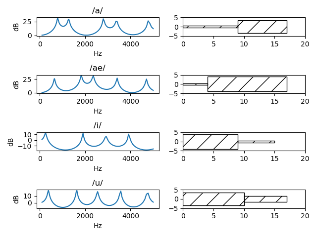
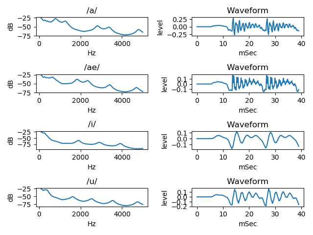

# vocal tract two tube model    

A python, draw frequency response and cross-sectional view (area) of a very simple vocal tract model, two tube model.  
  
  
[github repository](https://github.com/shun60s/Vocal-Tube-Model)  

## content    

draw vocal two tube model frequency response and cross-sectional view (area)  
```
python main1.py
```
  

  

draw frequency response and waveform, considering glottal voice source and mouth radiation  
```
python main2.py
```
  

  
draw waveform of glottal voice source  
```
python glottal.py
```
  

  

draw frequency response of HPF for simulate mouth radiation  
```
python HPF.py
```

## Document  

See Explain-E.pdf/Explain-J.pdf in the docs folder  
  

## License    
MIT  
